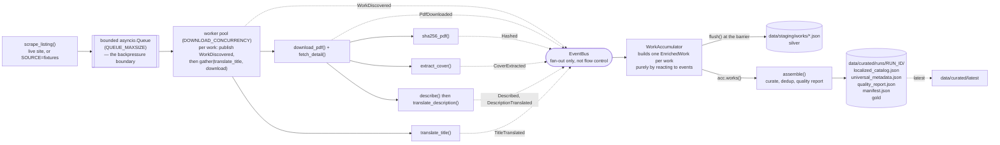

# Data Foundry — Domínio Público Pipeline

An event-driven, medallion-layered, versioned pipeline that ingests and enriches public-domain
books from [Domínio Público](https://dominiopublico.mec.gov.br/) into two contract datasets: a
localized catalog (title/description in `pt`/`en`/`es`/`fr`) and language-independent universal
metadata (hash, cover, size, category, year).

**The thesis:** stages react to data availability, not to a hardcoded `01 → 08` order; raw data is
immutable; every run is versioned, resumable, and auditable from one manifest.

This started from 8 flat scripts (`scrape → download → hash → describe → translate → covers →
assemble`). They were refactored into typed, async stage functions wired by a small home-grown
event-driven engine — no external orchestrator, no flat `data/output/`.

---

## Quickstart

```bash
make setup      # uv sync + copies .env.example -> .env if you don't have one yet
make run        # full pipeline via Docker + Ollama (real scrape + real LLM)
make test       # hermetic offline test suite — no network, no GPU, no Docker
```

### The offline path (no network, no GPU)

Every stage that would otherwise hit the network or a model has an offline mode, and they compose:

```bash
LLM_PROVIDER=mock SOURCE=fixtures uv run python -m data_foundry run --limit 12
# or, equivalently:
make run-offline
```

- `SOURCE=fixtures` replaces `scrape`/`download` with a small committed catalog of tiny PDFs under
  `tests/fixtures/pdfs/` (3 real book titles + as many procedurally-generated ones as `--limit`
  asks for, generated once via PyMuPDF and cached — never committed beyond the first 3).
- `LLM_PROVIDER=mock` replaces the real vision/translation calls with a deterministic string
  function (same input → same output, always).
- `make test` runs the exact same code path through `pytest` (see **Testing**, below) — this is
  what makes CI (and this whole exercise) reproducible without a GPU or an API key.

### Environment variables

All settings are typed (`src/data_foundry/config.py`, Pydantic `BaseSettings`) and read from the
process environment or a `.env` file (see `.env.example`).

| Variable | Default | Meaning |
|---|---|---|
| `LLM_PROVIDER` | `openai` | `mock` (deterministic, offline) or `openai` (OpenAI-compatible: Ollama or OpenAI itself) |
| `LLM_BASE_URL` | `http://localhost:11434/v1` | Ollama by default; point it at `https://api.openai.com/v1` for real OpenAI |
| `LLM_API_KEY` | `ollama` | Ollama ignores it; OpenAI needs a real key. Masked as `***redacted***` in every run's `manifest.json` |
| `LLM_MODEL` | `gemma4:e2b` | Any vision-capable chat model your endpoint serves |
| `SOURCE` | `live` | `live` scrapes the real site; `fixtures` replays the offline catalog |
| `DOWNLOAD_CONCURRENCY` | `4` | Semaphore around network I/O (scrape/download), and the outer per-work worker-pool size |
| `LLM_CONCURRENCY` | `2` | Semaphore around LLM calls (describe/translate), shared across all in-flight works |
| `QUEUE_MAXSIZE` | `16` | Bounded queue between `scrape` and the download worker pool — the backpressure boundary |
| `MAX_RETRIES` | `3` | Retries per stage call on a `TransientError`, exponential backoff + full jitter |
| `RETRY_BASE_DELAY_S` | `0.5` | Base delay (seconds) for that backoff |
| `REQUEST_TIMEOUT_S` | `30` | HTTP/LLM call timeout |
| `MIN_BOOKS` | `10` | The challenge's minimum catalog size (informational; not yet enforced as a hard gate) |
| `DATA_DIR` | `./data` | Root of the medallion layers (`<DATA_DIR>/{raw,staging,curated}`) |

### Individual stages

```bash
make hash       # sha256 every PDF already in data/raw/pdfs/
make covers     # extract + hash the first-page cover for every PDF already in data/raw/pdfs/
```

`make hash` and `make covers` are genuinely standalone — they only need PDFs already on disk.
`make download` / `make describe` / `make translate` / `make translate-descriptions` are wired as
`--only <stage>` CLI options too, but today they log a no-op warning and exit successfully: they'd
need the catalog/detail context a full run has (title, `download_url`, prior description) and
that per-work context isn't replayable in isolation yet — it lands in `data/staging/works/*.json`
during a full run, but nothing reads it back for a single ad-hoc stage. Use `make run-local` /
`make run-offline` for anything past hash/covers. (Being upfront about this because "every stage
runs standalone" would be a nicer sentence than what's actually true.)

---

## Architecture



**Medallion layers:**

- **`data/raw/`** (bronze, immutable) — scraped HTML/detail pages, downloaded PDFs
  (`raw/pdfs/<code>.pdf`), extracted covers (`raw/covers/<hash>.png`). Never mutated; a curation
  bug found six months from now is fixable by re-running assembly against the same raw data,
  not by re-scraping.
- **`data/staging/`** (silver) — one `EnrichedWork` JSON per work (`staging/works/<code>.json`):
  the raw listing entry, detail page, document hash, cover hash/path, description, and title/
  description translations, all in one normalized, schema-validated place.
- **`data/curated/runs/<run_id>/`** (gold) — the two contract datasets + `quality_report.json` +
  `manifest.json`, for one versioned run. `data/curated/latest` (a symlink, or `latest.txt` where
  symlinks aren't available) always points at the newest successful one.

**Event-driven flow, honestly described:**

- The **one** bounded-queue backpressure boundary in the system is between `scrape_listing`
  (paginated, can outrun everything downstream) and the download worker pool. If the LLM is slow,
  that queue fills up and `scrape_listing`'s `await queue.put(...)` blocks — a fast scraper can't
  exhaust memory while the LLM catches up.
- Once the worker pool dequeues a work, it publishes `WorkDiscovered` and runs `translate_title`
  and the download branch **concurrently** (`asyncio.gather`) — translation doesn't wait on the
  PDF. Downstream of a successful download, `hash` / `cover` / `describe→translate_description` are
  themselves a nested `asyncio.gather`, not additional queues. Every branch is still bounded —
  `DOWNLOAD_CONCURRENCY` and
  `LLM_CONCURRENCY` semaphores cap concurrent network/LLM calls globally across every in-flight
  work — but there's no second backpressure boundary between them; that's a simplification worth
  naming rather than implying a more elaborate multi-queue graph than what's actually running.
- The **event bus is functional, not decorative**: `WorkAccumulator` subscribes to every
  enrichment event and builds the silver layer purely by reacting to them — there is no other code
  path that assembles an `EnrichedWork`. A failing work anywhere emits `WorkFailed` (logged +
  counted) instead of raising past the stage boundary, so one bad work never stops the run — the
  **barrier** is simply the outermost `asyncio.gather` returning, which it only does once every
  discovered work's full lifecycle (both branches, and everything the download branch fans out to)
  has reached a terminal state.
- After the barrier: `flush()` writes the silver layer, then `assemble()` curates, dedups, and
  writes the two gold datasets + quality report into this run's versioned directory, and the
  manifest is finalized (`ctx.finish("success")`, `latest` repointed). An assembly exception marks
  the run `"failed"` and re-raises rather than silently producing partial/wrong outputs.

---

## The two output datasets

Both snippets below are real output from `make run-offline` (`SOURCE=fixtures` + `MockProvider` —
hence the `[en]`/`[mock-description]` markers; a real `OpenAIProvider` run has natural-language
text in their place).

**`localized_catalog.json`** — language-dependent fields:

```json
{
  "id": "fixture-001",
  "author": "Eça de Queirós",
  "title": {
    "pt": "A Cidade e as Serras",
    "en": "[en] A Cidade e as Serras",
    "es": "[es] A Cidade e as Serras",
    "fr": "[fr] A Cidade e as Serras"
  },
  "description": {
    "pt": "[mock-description] A Cidade e as Serras (obra fixture-001)",
    "en": "[en] [mock-description] A Cidade e as Serras (obra fixture-001)",
    "es": "[es] [mock-description] A Cidade e as Serras (obra fixture-001)",
    "fr": "[fr] [mock-description] A Cidade e as Serras (obra fixture-001)"
  }
}
```

**`universal_metadata.json`** — language-independent fields:

```json
{
  "id": "fixture-001",
  "document_hash": "eecb075198fbb0f92d34f11c616cd7653417db834ce4f1da48b8ad52562c496c",
  "cover_path": "raw/covers/4ef0ddae6739f16481649759715361fec5481793097059436611f6062ba7eef2.png",
  "accesses": null,
  "size_bytes": 1061,
  "category": "Romance",
  "year": 1901,
  "language": "pt",
  "institution": null,
  "source": "fixture catalog",
  "run_id": "20260915T140751Z-678e8c20"
}
```

(`accesses`/`institution` are `null` here because the fixture catalog doesn't set them — a real
`SOURCE=live` scrape populates both from the listing/detail pages.)

**Why split them at all?** Language-varying fields and language-independent invariants change for
completely different reasons: adding French support touches only the localized catalog; recomputing
a hash after a re-download touches only universal metadata. One combined record would force every
translation update to rewrite hash/cover/size fields it has no opinion about. This is normalization
applied to a data contract, not just a JSON shape — and the split is enforced by construction:
`assemble()` dedups `universal` by `document_hash` and then drops whatever ids that removed from
`localized` too, so the two files **always** share exactly one id set (what `test_outputs.py`
checks). `institution`/`language`/`source`/`run_id` on `universal_metadata` are additive fields the
challenge explicitly allows expanding — the two hard-contract shapes are never shrunk.

---

## Design decisions & trade-offs

- **Medallion layers over one flat `output/`.** Immutable raw enables re-processing and audit — a
  curation bug is fixable by re-running assembly against the same PDFs, not by re-scraping a site
  that may have changed. Cost: storage duplication (raw PDF + its cover + its staging JSON + its
  place in a curated dataset).
- **A home-grown `asyncio` engine, not Airflow/Temporal/Prefect.** Zero infrastructure, runs in one
  container, and *demonstrates* backpressure/rate-limiting/retry directly instead of hiding them
  behind a framework. Trade-off, stated plainly: a real production deployment moving books at scale
  would use a durable workflow engine (Temporal) or a DAG scheduler (Airflow/Dagster) for
  persistence across process restarts, retries that survive a crash mid-run, and built-in
  observability — this pipeline's state lives in one process's memory until the barrier flushes it.
  We chose the lightweight option deliberately, for this scope.
- **Bounded queue = backpressure; semaphores = rate limiting; retry = backoff + full jitter.**
  Three different problems, three different primitives, on purpose: a full queue blocks the
  *producer* (protects memory); a semaphore blocks the *scheduler* (protects the remote resource's
  rate limit); jittered backoff (`with_retry` in `orchestrator/engine.py`) staggers retries so a
  transient blip doesn't turn into a synchronized thundering herd. The LLM is the slow stage — the
  queue exists specifically so a fast scraper can't outrun it and blow up memory.
- **At-least-once + idempotent, resumable stages.** `download_pdf` skips if the PDF already exists;
  `extract_cover` is content-addressed by hash, so re-running never duplicates; a crashed run
  re-runs safely and picks back up rather than redoing finished work — the same principle a
  production ingestion client needs.
- **The `TransientError` contract.** The engine only knows how to retry `TransientError` (plus
  plain `OSError`, for local I/O). Stages translate whatever their own HTTP/LLM client raises
  (`curl_cffi.requests.RequestsError`, Playwright's `Error`, `openai.APIConnectionError`/
  `RateLimitError`) into it at the boundary. This was a real bug we caught and fixed mid-build:
  `curl_cffi`'s exceptions happen to subclass `OSError` already, but Playwright's and OpenAI's
  don't — so retry was silently a no-op for those until the stages started normalizing errors
  explicitly, decoupling the engine from which library a stage happens to use.
- **Option B refactor.** The 8 original scripts are tools, not the solution: their logic now lives
  in typed, async stage functions (`stages/scrape.py`, `download.py`, `hash.py`, `covers.py`,
  `describe.py`, `translate.py`, `assemble.py`) — one source of truth, individually runnable via
  the CLI where that's meaningful (see **Individual stages**, above) — with no duplicated flat-file
  scripts left behind.
- **Pluggable LLM + a deterministic mock.** `llm.factory.get_provider` selects `MockProvider` or
  `OpenAIProvider` by `LLM_PROVIDER` — swapping Ollama, OpenAI, or a hermetic mock is an env change,
  never a code change (the JD's "AI-assisted workflows, swappable via env"). The mock is what makes
  `make test`/CI possible with no GPU and no API key. Productionization note: the real provider
  today accepts free-text model output; a production rollout would add **structured outputs**
  (JSON/Pydantic-validated responses, so a malformed answer fails validation instead of silently
  corrupting a field) and a **gold-set regression check** (a small set of known works whose
  expected shape is asserted on every model/prompt change) — not required by this challenge's
  plain-text prompts, but the right next step.
- **Quality: quarantine over crash; dedup surfaces, never hides; never coerce garbage to 0.**
  `curate_works` isolates one bad work into a `QuarantinedRecord` instead of raising past it —
  correctness (Pydantic validation) *and* robustness (the run continues) together. Duplicate
  `document_hash`/`cover_hash` groups are always reported in `quality_report.json`, even the ones
  dropped from the final dataset. An unparsable access count becomes `None`, never a silently wrong
  `0` — a missing number is honest; a wrong one is a landmine for whoever reads it next.
- **Pure Python for curation, not Pandas/DuckDB.** The records are few (tens to low thousands) and
  nested (`title{pt,en,es,fr}`), not naturally tabular — pure typed functions stay clearer and
  lighter at this shape/scale. Pandas/DuckDB would earn their keep if this were millions of flat
  rows; tools follow shape and scale here, not habit.
- **Versioned runs + a manifest as the "datasheet."** Every run gets `run_id` = UTC timestamp + a
  short uuid, its own immutable directory, and a `manifest.json` recording git sha, redacted
  config, per-stage counts, the quality report, and each output's relative path + sha256. One file
  answers "what did this run produce and how clean was it?" without re-deriving anything.
- **Consistency by construction.** `assemble()` computes duplicate groups from `universal`, drops
  those ids from `universal`, and then drops the *same* ids from `localized` — the two datasets
  cannot drift apart, because there is no code path where only one of them gets updated.

---

## Data quality

Handled in `quality/` (Step 2), applied at assembly time (Step 5):

- **Encoding/mojibake repair** (`ftfy`) — `"São Paulo"` → `"São Paulo"`, idempotent on already-clean text.
- **Whitespace/nbsp normalization** and **sentinel detection** — `"-"`, `"N/A"`, `"sem informação"`,
  etc. all map to `None`, case-insensitively, instead of surviving as garbage strings.
- **pt-BR locale number parsing** — `"12.345 acessos"` → `12345`; unparsable input → `None`, never
  a silently-wrong `0`.
- **Language code normalization** — `"Português"`/`"pt-BR"`/`"portugues"` all fold to `pt`; unknown
  values are cleaned but kept as-is (never dropped, since we can't map them but do have them).
- **Quarantine** — a work that fails Pydantic validation (e.g. no PT title) is isolated into
  `QuarantinedRecord(id, reason, raw)` and surfaced in the report; the run doesn't crash.
- **Dedup** — by `document_hash` (same PDF re-downloaded under two listing entries → one work kept,
  the duplicate group reported) and by `cover_hash` (reused covers → informational only, nothing
  dropped).
- **`quality_report.json`** — `total_works`, `valid_works`, `quarantined`, both duplicate-group
  kinds, `missing_by_field`, and `coverage` (fraction non-null) per field — computed over
  everything curation found, duplicates included, not the post-dedup view.

---

## Testing

Two kinds of tests, on purpose:

1. **Code tests** — pure functions and the engine, with synthetic/fake inputs: `test_normalize.py`,
   `test_curate.py`, `test_dedup.py`, `test_report.py`, `test_engine.py` (concurrency cap, retry,
   per-item isolation, backpressure — all with fake stages, no real I/O), `test_staging.py`,
   `test_assemble.py`, `test_mock_provider.py`, `test_llm_factory.py`, `test_scrape_parse.py`,
   `test_stages.py`, `test_schemas.py`, `test_versioning.py`.
2. **A data test** — `test_outputs.py` validates the *actual assembled output* of a real (offline)
   pipeline run against the contract: both datasets exist and are non-empty, ≥10 works, required
   fields present, and `localized`/`universal` share one id set.

`test_outputs.py` originally read the legacy flat `data/output/` the 8 scripts produced. Once that
directory stopped being produced (Step 3's refactor moved everything to the medallion layers, and
Step 5 wired up real assembly), it was **repointed** — same assertions, same intent — to
`data/curated/latest/`, resolving the `latest` symlink (or `latest.txt` on platforms without one).
A session-scoped fixture in `tests/conftest.py` runs the pipeline once, fully offline
(`SOURCE=fixtures` + `MockProvider`, ≥10 works), into an isolated temp `data_dir` — isolated so
running the test suite never overwrites a developer's real `data/curated/latest` from an actual
`make run` — and every `test_outputs.py` test reads from that real, freshly-produced run.

---

## Which target areas are covered

All five. Nothing here is aspirational — each row is code that exists and is tested.

| Area | Where |
|---|---|
| **Event-Driven** | `orchestrator/events.py` (typed events + pub/sub bus), `orchestrator/engine.py` (the generic bounded-queue worker pool), `pipeline.py` (the concrete work graph), `staging/accumulator.py` (the bus's actual consumer) |
| **Data Architecture** | `data/raw` → `data/staging/works/*.json` → `data/curated/runs/<run_id>/`; `config.py`'s layer paths; the localized/universal dataset split |
| **Versioning** | `run.py`'s `RunContext` — `run_id`, immutable per-run directory, `manifest.json`, `latest` pointer, re-runs never overwrite |
| **Scalability** | `orchestrator/engine.py` — bounded queue (backpressure), semaphores (rate limiting), `with_retry` (backoff + full jitter); idempotent/resumable stages throughout `stages/` |
| **Data Quality** | `quality/normalize.py`, `curate.py` (quarantine), `dedup.py`, `report.py` → `quality_report.json`, wired into `stages/assemble.py` |

---

## What I'd do differently at scale

- **A durable orchestrator** (Temporal, or a DAG scheduler like Airflow/Dagster) once runs need to
  outlive a single process — persistence across restarts, retries that survive a crash mid-run,
  and built-in observability, instead of an in-memory accumulator and a barrier inside one coroutine.
- **A real store for staging/curated** — object storage plus a table format (Iceberg/Delta) instead
  of per-work JSON files, and DuckDB/Parquet once the catalog is large enough to be genuinely
  tabular (see the Pandas/DuckDB trade-off, above — this is exactly the point where it would flip).
- **LLM reliability** — structured outputs (JSON/Pydantic-validated), a gold set with a measured
  error rate, confidence-based routing to a stronger model on low-confidence output, and an
  LLM-as-a-judge pass for QA sampling.
- **Observability** — metrics/traces on stage latency and failure rates, plus freshness/volume
  alerts on the curated output (this manifest answers "what happened" after the fact; production
  needs to know *while* it's happening).
- **Dedup beyond exact hash** — near-duplicate detection (MinHash/LSH) and entity resolution once
  the catalog is large enough that two different scans/editions of the same work are common and
  won't share a `document_hash`.

---

## Project layout

```
src/data_foundry/
├─ config.py            # typed Settings (env / .env)
├─ schemas.py            # Pydantic contracts: domain, output datasets, manifest
├─ run.py                # RunContext: run_id, versioned dirs, manifest, `latest`
├─ logging_setup.py       # structured logging
├─ main.py / __main__.py  # CLI: `python -m data_foundry run [--only STAGE] [--limit N]`
├─ pipeline.py            # wires the concrete work graph onto the engine primitives
├─ orchestrator/
│  ├─ events.py           # typed events + the async pub/sub bus
│  └─ engine.py           # bounded queue, semaphores, with_retry, per-item isolation
├─ stages/                # scrape, download, hash, covers, describe, translate, assemble
│  └─ fixtures_source.py  # the SOURCE=fixtures offline replay source
├─ staging/
│  └─ accumulator.py      # WorkAccumulator: events -> EnrichedWork -> silver layer
├─ quality/               # normalize, curate (quarantine), dedup, report
└─ llm/                   # LLMProvider Protocol, MockProvider, OpenAIProvider, factory
```

---

## Docker / Compose

`make run` builds the pipeline image and starts it alongside an Ollama container
(`compose.yaml`), mounting `./data` into the container so the medallion layers land on your host
filesystem. It reads `.env` (`make setup` creates one from `.env.example` if you don't have one).
`make setup-ollama` additionally starts Ollama and pulls the default model (`gemma4:e2b`) before
the first real run.
